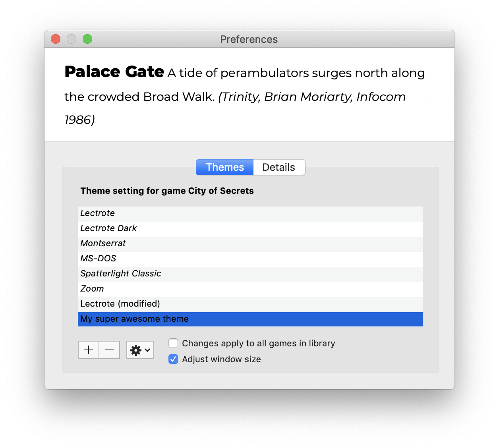

# The Pectoral Skybreak Spatterlight

## Interactive Fiction for macOS

Spatterlight is a native Cocoa application that plays most parser-based interactive fiction game files: AGT, Adrift (except v5), AdvSys, Alan, Glulx, Hugo, Level 9, Magnetic Scrolls, TADS (text-only), and Z-code (except v6). See [Credits.rtf][credits] for more details.

[credits]: https://github.com/angstsmurf/spatterlight/blob/master/resources/Credits.txt "Credits.rtf: Credits for Spatterlight libraries"

Download the latest release [here](https://github.com/angstsmurf/spatterlight/releases)!

Then report bugs on the [issues tracker][issues].

[issues]: https://github.com/angstsmurf/spatterlight/issues "The issues page of this repository"

# Features
- VoiceOver support
- Themes
- Per-game settings
- Easy download of game info from Ifdb
- Sounds, images and text colours
- Autosave and autorestore for Glulx and Z-code games

#

A promotional video for Spatterlight 0.5.13b: https://youtu.be/KXbk_gpLQ8w

And another one for 0.5.12b: https://youtu.be/Y07jFFvjsnE

  

# Gameplay videos

Beyond Zork: https://youtu.be/GzYmywCm_24

Guilty Bastards: https://youtu.be/vXjZwwlFqyQ

Necrotic Drift: https://youtu.be/Um8z7X91S8U

Cryptozookeeper: https://youtu.be/1MkdVnhZRl8

Hugo Tetris: https://youtu.be/G-tTzXso6AA

# Compiling

Building the current version has only been tried on macOS 11 Big Sur and Xcode 13. If you have success on earlier versions, please let me know! The resulting binary will still run on 10.10 Yosemite, though.

Clone or download the source. Open the file `Spatterlight.xcodeproj` in Xcode. Make sure that the target is set to `Spatterlight > My Mac`. Press the Build & Run button.

Note that the `master` branch has the QuickLook plugins disabled. To enable them, you must use the `release` branch, which requires at least setting your Apple Developer Group ID on all targets, and possibly other changes as well.

#

Spatterlight supports the [Treaty of Babel][babel] standard for cataloguing bibliographic information about interactive fiction.

[babel]: http://babel.ifarchive.org "Interactive Fiction Archive: Treaty of Babel"

The Spatterlight application is released under the GNU Public License; the interpreters and libraries it uses are freely redistributable and covered by their own specific licenses.

This is beta software! There is no warranty: use it at your own risk. You will need macOS 10.10 or higher for the latest version, but there are older versions compatible with older systems.

Spatterlight was originally written by Tor Andersson. Copyright 2007-2020 by Tor Andersson and the respective interpreter authors.
