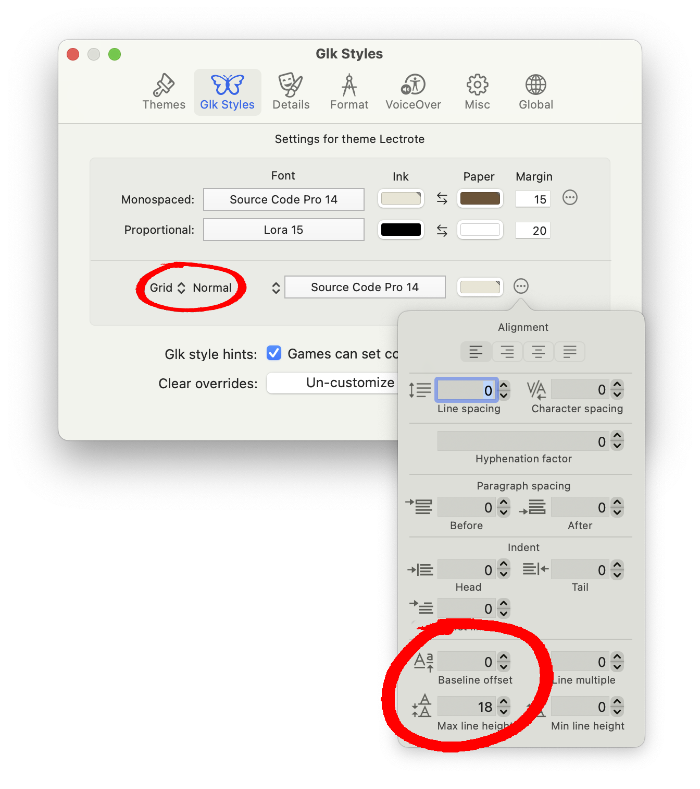
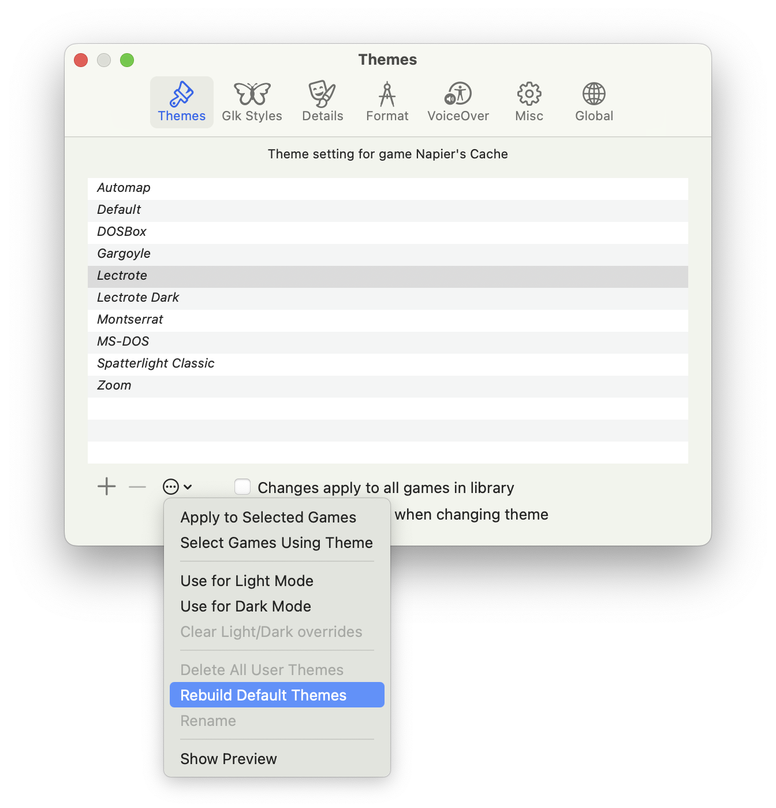
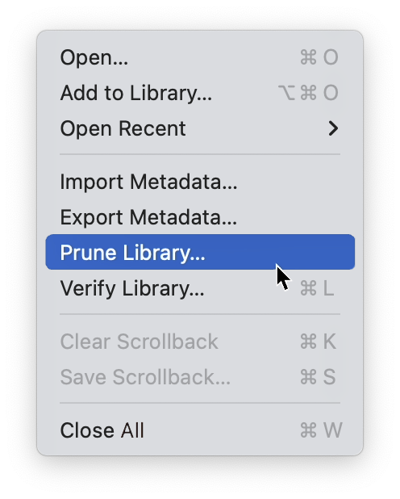
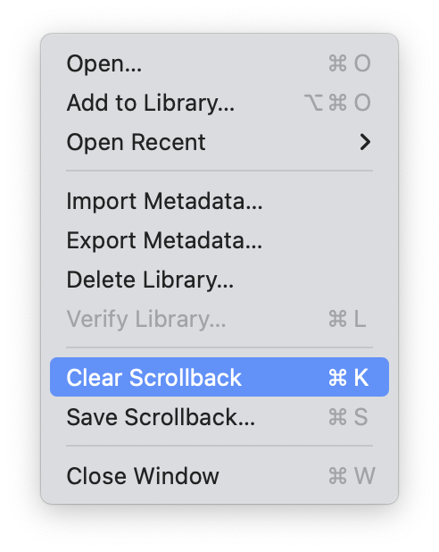
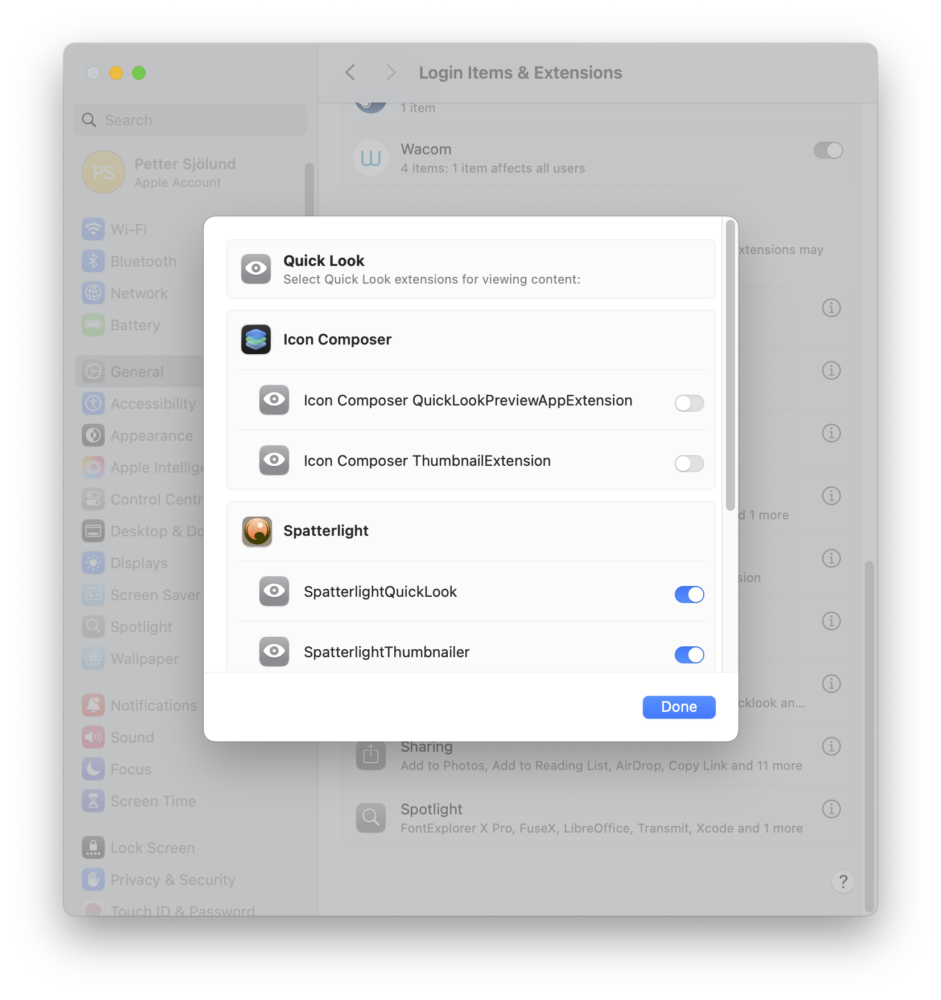

# Fixes for common problems

## Weird text in status bar

If text is cut off or line spacing looks wrong in the status bar or other grid text windows, it might be fixed by changing the paragraph settings of the Grid Normal style.

You do this on the Glk Styles tab of the settings window, by setting the pop-up menus below the line (set to Buffer Input by default) to Grid Normal (the first one to Grid, the second to Normal) and then opening the paragraph settings pop-up sheet for this style by clicking the "ellipsis in a circle" button to the right.

Baseline offset and Max line height are the most likely culprits.

  

## Other font setting problems

If one of the built-in themes does not seem to work as it should, you can delete and re-create all built-in themes with the Rebuild Default Themes menu item on the Themes Settings tab. (The "ellipsis in a circle" icon below the list.)

  

## Getting rid of game information

When a game is deleted on the Interactive Fiction library window, Spatterlight will remember all metadata such as title and cover image, so that they will still be there if you open the deleted game again. To completely get rid of all metadata, select the "Prune Library…" command by holding down the option key (⌥) while opening the File menu. As a nuclear option, you may also "Delete Library…", which will delete all metadata along with all your games. 

  

## Slowdowns

If you have played a game for a long time and it has printed a lot of text to the scrolling main window without ever erasing it, things may eventually become slow and unresponsive. You may be able to fix this with the File > Clear scrollback command, which will delete all the text printed so far.

  

## Playing games without adding them to the library

You may just want to play a game without it getting added to the library. There is a setting for this in the Open… dialog (the file dialog with the text "Please select a game".) Press the Show Options button to reveal the Add to library checkbox.

There is a setting for this on the Global settings tab as well. Here you can uncheck "Add games to library when opened", and also "Show library window automatically" if you don't want to see the library window at all.

## Custom Finder icons and previews

By default, Spatterlight will install Finder extensions which provide custom previews and icons for many supported file types. If you don't want these, they can be turned off in System Settings > Login Items & Extensions > Quick Look > Spatterlight.

  

